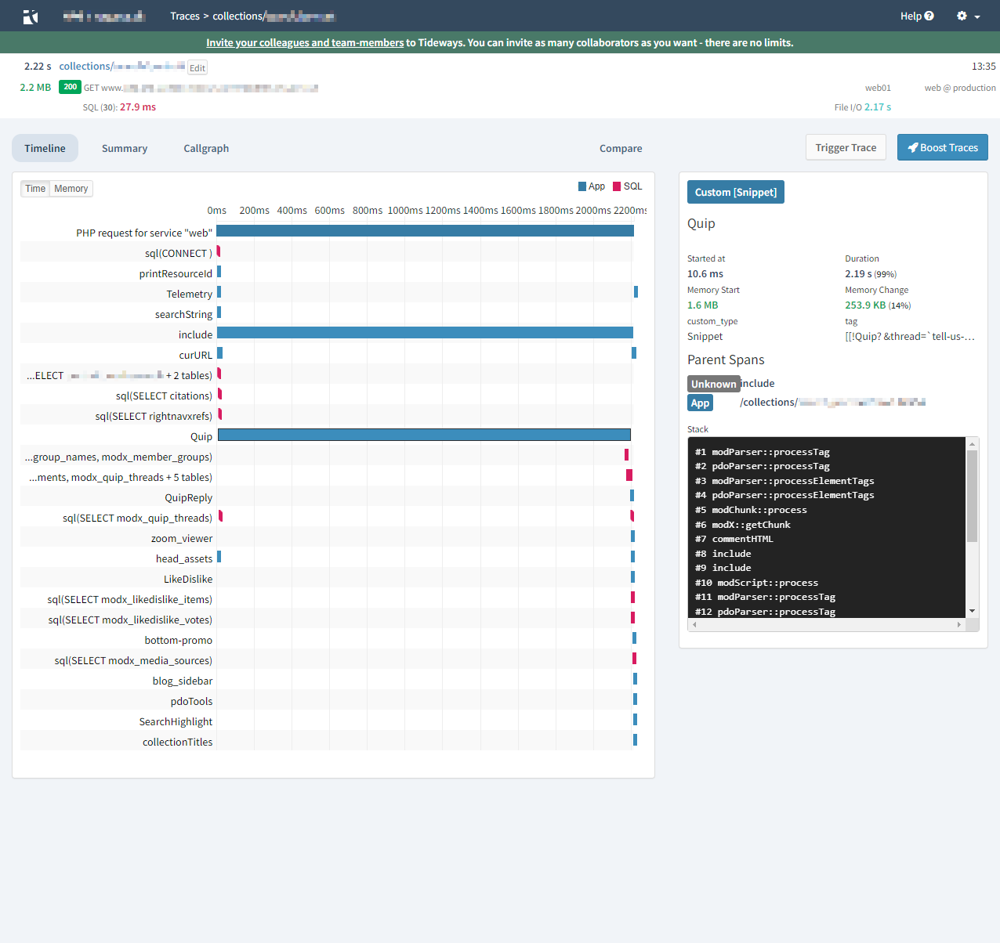

# Profile MODX to find performance bottlenecks in your PHP code

# What does it do?

This extra integrates with Tideways or ~~DataDog~~ (coming soon!) to provide production tracing and profiling of your MODX application.

These services provide a way to see what is happening in your application, and where the bottlenecks are. This can help you to identify performance issues, and to see where you can improve your code.

You can do this in production with no impact on your users, and very little performance impact on your application.

# Benefits
* See which snippets and plugins are taking the most time to execute
* See which resources are taking the most time to load
* See which database queries are taking the most time to execute
* See which database queries are being executed the most

## Supported APM systems 

(DataDog support coming soon!)
# Install Tideways profiling

1. Create a new plugin in MODX and copy & paste the correct file into it:
   - [MODX Profiling with Tideways](plugins/tideways.php)

2. Set the following plugin events:
   * OnLoadWebDocument
   * OnWebPagePrerender
   * OnMODXInit
   * OnPageNotFound

3. Save the plugin. That's it!

## Optional configuration
Tideways will treat every resource as a separate page. Its plans have limits, plus to get useful data you will want to group similar pages together. For example all your blog posts, or all your product pages.

To do this, you can edit the plugin and add your own logic to the `OnLoadWebDocument` event. An example is present but commented out.

This will be improved in a future release of the plugin.
